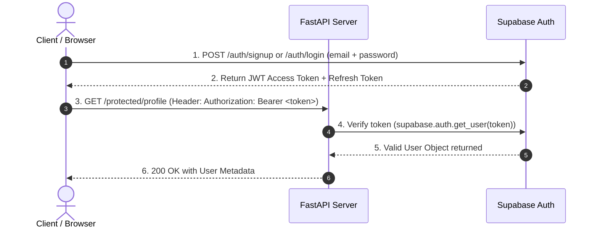

# FlyRank Secured Auth API with Supabase & FastAPI


A production-grade, secure RESTful backend API built with **FastAPI**, **Supabase Auth (Identity Provider)**, and **JWT Bearer token verification middleware**. Features user signup, login with rate limiting, token refresh, session logout, protected endpoints, role-based authorization (403 Forbidden), interactive Swagger UI authentication, and automated tests.

---

## 1. The Big Idea: The Trust Triangle

Secure authentication relies on a trust triangle between three parties:



- **Client**: Requests access and presents the signed JSON Web Token (JWT).
- **Identity Provider (Supabase)**: Hashes passwords securely, manages accounts, and signs cryptographically verifiable JWTs.
- **FastAPI Server**: Verifies the JWT signature with Supabase on protected routes without ever storing plain or hashed passwords.

---

## 2. API Endpoint Reference

| Endpoint | Method | Auth Required | Status Codes | Description |
| :--- | :---: | :---: | :---: | :--- |
| `/public/info` | `GET` | ❌ None | `200` | Open public information endpoint. |
| `/auth/signup` | `POST` | ❌ None | `201`, `400` | Register a new account via Supabase. |
| `/auth/login` | `POST` | ❌ None | `200`, `400`, `401`, `429` | Authenticate user & return JWT + Refresh Token. Includes rate limiting. |
| `/auth/refresh` | `POST` | ❌ None | `200`, `400`, `401` | Exchange a refresh token for a new access token. |
| `/auth/logout` | `POST` | 🔐 Bearer JWT | `204`, `401` | Terminate user session. |
| `/protected/profile` | `GET` | 🔐 Bearer JWT | `200`, `401` | Retrieve authenticated user profile metadata. |
| `/protected/dashboard` | `GET` | 🔐 Bearer JWT | `200`, `401` | Reusable auth guard demonstration endpoint. |
| `/protected/admin` | `GET` | 🔐 Bearer JWT | `200`, `401`, `403` | Admin role authorization endpoint (returns `403` for non-admins). |

---

## 3. Environment & Configuration Setup

Secrets and credentials are managed strictly via environment variables and are **never** committed to Git repository history.

1. **Copy `.env.example` to `.env`:**
   ```bash
   cp .env.example .env
   ```

2. **Configure your Supabase credentials in `.env`:**
   ```ini
   SUPABASE_URL=https://your-project.supabase.co
   SUPABASE_KEY=your_supabase_anon_public_key
   PORT=8000
   ```
   > [!IMPORTANT]
   > Use the public **`anon`** key from your Supabase Dashboard (**Settings -> API**). Never use the `service_role` key in application code as it bypasses all Row Level Security.

---

## 4. Running the Application

### Option A: Local Execution
```bash
# Activate virtual environment
.\venv\Scripts\activate

# Install dependencies
pip install -r requirements.txt

# Start FastAPI application
uvicorn app.main:app --reload --port 8000
```

### Option B: Docker Compose Container
```bash
docker compose up --build
```

The API will be live at `http://localhost:8000`.

---

## 5. Interactive Swagger UI & Bearer Auth

FastAPI provides an interactive OpenAPI / Swagger UI at **`http://localhost:8000/docs`**.

1. Open `http://localhost:8000/docs` in your browser.
2. Click on `POST /auth/login` -> **Try it out** -> enter valid credentials -> execute.
3. Copy the returned `access_token` string from the JSON response.
4. Click the **Authorize** padlock button at the top right (or next to protected endpoints).
5. Paste your token into the Value box and click **Authorize**.
6. Try out any protected endpoint (`GET /protected/profile`, `GET /protected/dashboard`, `POST /auth/logout`) directly from your browser!

---

## 6. Key Security Concepts

### 401 Unauthorized vs 403 Forbidden
- **401 Unauthorized** ("Who are you?"): Returned when a request is missing an Authorization header, presents an expired token, or provides invalid credentials.
- **403 Forbidden** ("I know who you are, but no."): Returned when the user is successfully authenticated, but lacks the necessary privileges/roles (e.g., non-admin accessing `/protected/admin`).

### Short-Lived Access Tokens & Refresh Flow
- **Access Tokens**: Short-lived (default 1 hour) to minimize damage if stolen.
- **Refresh Tokens**: Longer-lived tokens used with `POST /auth/refresh` to issue new access tokens without requiring the user to re-type their password.

### Brute-Force Rate Limiting (429 Too Many Requests)
- `POST /auth/login` limits consecutive failed authentication attempts per user/IP.
- Exceeding the threshold triggers HTTP `429` ("Too many failed login attempts. Please try again later.").

---

## 7. Stage 7: The AI Rematch Comparison

### Prompt Used:
> *"Create a FastAPI application with Supabase Auth handling signup, login, logout, public routes, and protected routes using JWT token verification via middleware. Include appropriate HTTP status codes (201, 200, 204, 400, 401) and Swagger UI documentation."*

### Comparative Analysis & Security Review:

1. **Token Extraction & Header Parsing**:
   - *AI Code*: Performed naïve string splitting (`authorization.split(" ")[1]`) directly on a raw string `Header`, which crashes with an `IndexError` (500 Internal Server Error) if the header is malformed or lacks a space.
   - *Our Code*: Uses FastAPI's formal `HTTPBearer` security dependency (`app/auth.py`), which cleanly handles malformed headers and returns a standard `401` (`"Access token required"`).

2. **Error Handling & Security Vulnerabilities**:
   - *AI Code*: Assumed `supabase.auth.get_user(token)` would always succeed without throwing exceptions, allowing unhandled runtime exceptions to leak stack traces to clients.
   - *Our Code*: Wraps Supabase API calls in explicit try-except blocks, catching expired/tampered tokens and returning formatted `401 Unauthorized` JSON errors. Also includes in-memory brute-force rate limiting (`429`).

3. **Silent Decisions & Omissions**:
   - *AI Code*: Forgot input validation for empty/whitespace strings, omitted refresh token rotation, did not implement role authorization (403 Forbidden), and duplicated header parsing logic inside each route instead of a centralized, reusable dependency guard.

---

## 8. Automated Testing

Run the full automated unit and integration test suite with `pytest`:

```bash
pytest tests/test_auth.py
```

Result: **15 passed tests** verifying public routes, signup/login validation, token verification, logout, rate limiting (429), and role authorization (403).
